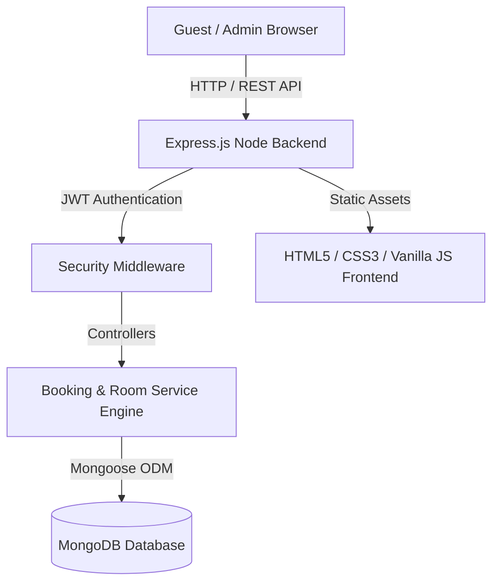

<div align="center">

  

  # ✨ TAJ GRAND PALACE & RESORT
  ### *Full-Stack Luxury Hospitality & Online Booking Solution*

  <br />

  <a href="https://hotal-taj.vercel.app/" target="_blank">
    
  </a>
  &nbsp;
  <a href="https://hotal-taj.vercel.app/admin.html" target="_blank">
    
  </a>
  &nbsp;
  <a href="#-hire-me--freelance-services">
    
  </a>

  <br /><br />

  ```
  ┌─────────────────────────────────────────────────────────────────────────┐
  │  🏨 Production-Grade Hotel Platform  •  📱 100% Mobile Responsive        │
  │  ⚡ Ultra-Fast Vanilla JS Frontend    •  🛡️ Secure Node.js & MongoDB API │
  └─────────────────────────────────────────────────────────────────────────┘
  ```

  <br />

  <!-- Tech Stack Badges -->
  
  
  
  
  
  
  
  

</div>

---

<div align="center">

| 🚀 100% Performance | 🛡️ Secure Auth & RBAC | 📱 Mobile First | 💎 Luxury Aesthetics |
| :---: | :---: | :---: | :---: |
| Optimized assets & zero heavy bloat | JWT & Bcrypt encryption | Tailored for iOS & Android | Glassmorphism & Gold accents |

</div>

---

## 🌟 Live Demo Links

- 🌐 **Guest Website**: [https://hotal-taj.vercel.app/](https://hotal-taj.vercel.app/)
- 🔑 **Admin Dashboard**: [https://hotal-taj.vercel.app/admin.html](https://hotal-taj.vercel.app/admin.html)

---

## 📸 Visual Gallery & Interface Preview

<div align="center">

| 🏨 Luxury Home & Hero Section | 🛌 Suite Booking Engine |
| :---: | :---: |
| <a href="https://hotal-taj.vercel.app/"></a> | <a href="https://hotal-taj.vercel.app/rooms.html"></a> |
| *Modern hero banner with instant search* | *Interactive guest filters & instant rates* |

<br />

| 🍽️ Fine Dining Reservations | 🔑 Admin Control Center |
| :---: | :---: |
| <a href="https://hotal-taj.vercel.app/dining.html"></a> | <a href="https://hotal-taj.vercel.app/admin.html"></a> |
| *Gourmet table booking & menu preview* | *Real-time booking management & metrics* |

</div>

---

## 🔥 Key Features at a Glance

### 👑 Guest Facing Experience
- [x] **Smart Room & Suite Booking Engine** — Filter by check-in/out dates, guest counts, and room types with live availability check.
- [x] **Gourmet Dining Reservations** — Interactive table booking for hotel restaurants with time slot selection.
- [x] **Spa & Wellness Concierge** — Browse wellness packages, massages, and schedule appointments.
- [x] **Events & Banquets Booking** — Conference hall & luxury wedding venue request form with guest capacity selectors.
- [x] **Filterable HD Photo Gallery** — Filter high-res images by Architecture, Suites, Pool, and Dining.
- [x] **Contact & Support Hub** — Dynamic contact form with Google Maps location preview & client-side validation.
- [x] **Micro-Animations & Dynamic UI** — Smooth hover states, modal popups, toast notifications, and responsive navbar drawer.

### 🛡️ Hotel Management & Admin Panel (`admin.html`)
- [x] **Live Reservation Tracking** — View all incoming room bookings with guest details and payment statuses.
- [x] **One-Click Action Center** — Approve, confirm, or cancel bookings instantly.
- [x] **Room Catalog CRUD** — Add new luxury suites, update pricing, toggle availability, and edit amenities.
- [x] **Inquiry Inbox** — Read and respond to contact messages & event venue requests in real-time.
- [x] **Business Analytics Dashboard** — Overview metrics for revenue, room occupancy rates, and active requests.

---

## 🛠️ Architecture & Tech Stack



<details>
<summary><b>🔍 Expand Full Stack Breakdown</b></summary>

<br />

| Layer | Component | Description |
| :--- | :--- | :--- |
| **Frontend UI** | HTML5 / CSS3 / ES6 JS | Zero external framework overhead, lightning fast 60fps UI |
| **Styling** | Custom CSS System | Design tokens, CSS Variables, Flexbox/Grid, Dark/Gold luxury theme |
| **Backend** | Node.js & Express | Scalable MVC architecture with clean route/controller separation |
| **Database** | MongoDB & Mongoose | Flexible document database for rooms, bookings, and contact inquiries |
| **Security** | JWT & Bcrypt | Role-based admin authorization and hashed credentials |

</details>

---

## ⚡ Quick Start & Setup Guide

### 1️⃣ Prerequisites
Make sure you have installed:
- [Node.js (v16+)](https://nodejs.org/)
- [MongoDB](https://www.mongodb.com/) (Local or MongoDB Atlas cluster)

### 2️⃣ Clone & Install

```bash
# Clone the repository
git clone https://github.com/Nidhex/HotalTaj.git

# Enter project root directory
cd HotalTaj
```

### 3️⃣ Backend API Setup

```bash
cd backend
npm install
```

Create a `.env` file inside the `backend` folder:

```env
PORT=5000
MONGO_URI=mongodb+srv://<user>:<password>@cluster0.mongodb.net/hotel_taj?retryWrites=true&w=majority
JWT_SECRET=taj_super_secret_key_2026
CLIENT_URL=https://hotal-taj.vercel.app
```

Start the backend server:

```bash
# Development mode with nodemon
npm run dev

# Production mode
npm start
```

### 4️⃣ Launch Frontend

Since the frontend is built using native web standards, simply open `index.html` in your browser or run:

```bash
# From project root
npx serve ./
```

🌐 Open your browser at **`http://localhost:3000`** or access the live deployment at **`https://hotal-taj.vercel.app/`**

---

## 🔌 API Endpoint Documentation

<details>
<summary><b>📡 Click to view available REST API Endpoints</b></summary>

<br />

### 🛌 Rooms & Suites
- `GET /api/rooms` — Get all rooms (supports filters `type`, `capacity`, `price`)
- `GET /api/rooms/:id` — Get single room details
- `POST /api/rooms` — *(Admin)* Create new room listing

### 📅 Bookings & Reservations
- `POST /api/bookings` — Create a new guest reservation
- `GET /api/bookings` — *(Admin)* Fetch all guest bookings
- `PUT /api/bookings/:id/status` — *(Admin)* Update booking status (`Confirmed`, `Cancelled`, `Pending`)

### 📩 Contact & Inquiries
- `POST /api/contact` — Submit a guest message or event inquiry
- `GET /api/contact` — *(Admin)* View guest messages

### 🔑 Authentication
- `POST /api/auth/login` — Admin login & return JWT token

</details>

---

## 💼 Freelance Services & White-Label Licensing

> ### 💡 *Need a custom web application for your Hotel, Resort, or Airbnb?*
> This project can be customized and rebranded for your business within **48 to 72 hours**!

### Custom Features I Can Add For You:
- 💳 **Online Payment Gateways**: Integration with **Stripe, PayPal, Razorpay, or Square**.
- 📅 **Calendar Sync**: Synchronization with **Airbnb, Booking.com, and VRBO (iCal)**.
- 📱 **WhatsApp & SMS Notifications**: Instant booking alerts sent to your phone and the guest.
- 🌐 **Multi-Language & Currency**: Instant currency converter ($ / € / £ / ₹) & multi-language translation.
- 🏨 **Multi-Property Dashboard**: Manage multiple hotel branches or villa rentals from one admin account.

---

## 🤝 Hire Me / Freelance Services

If you are looking for a reliable full-stack web developer to build your hotel site, e-commerce store, or custom SaaS web app, let's connect:

<div align="center">

<a href="mailto:nidsvaishnav10@gmail.com">
  
</a>
&nbsp;
<a href="https://www.linkedin.com/in/nidhish-vaishnav-0aa288386/" target="_blank">
  
</a>
&nbsp;
<a href="https://upwork.com">
  
</a>
&nbsp;
<a href="https://fiverr.com">
  
</a>

<br /><br />

**⭐ Don't forget to star this repository if you found it useful! ⭐**

</div>

---

<div align="center">
  <sub>Designed & Developed with precision for High-Conversion Hospitality Web Platforms.</sub>
</div>
